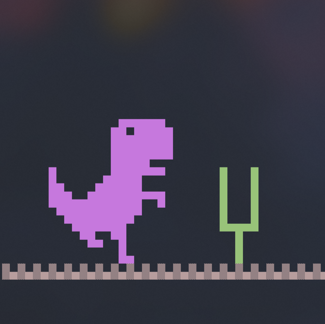

# Console Dino Runner 🦖

A simple **Chrome Dinosaur-inspired console game** written in C for Windows. Jump over cacti, survive as long as you can, and beat your high score!

---

## Screenshots

|  |  |
| ------------------------ | -------------------------- |
| Game Screen              | Lobby Screen               |

---

## Demo Video 🎬

Watch the game in action! [Video](https://youtu.be/nDE3G3uUrWc)

---

## Modifying/Editing the Code in IDEs

Depending on the IDE you use, there are small differences when opening and editing the code:

- **VS Code**  
  When opening the code in VS Code, make sure to open it with **DOS (CP437) encoding**. This ensures all characters display correctly, especially if the code contains special ASCII characters. To do this:

  1. Open the file in VS Code.
  2. Click the **UTF-8** label in the bottom-right corner of VS Code.
  3. Select **Reopen with Encoding → DOS (CP437)**.

- **Code::Blocks**  
  No special encoding is needed. Simply open the project and edit the files normally.

---

## Features

- Console-based gameplay with colorful ASCII graphics.
- Smooth dinosaur running and jumping animations.
- Randomly spawning cacti for endless fun.
- Score tracking and high score system.
- Background music and sound effects for jumps and collisions.
- Beginner-friendly code — perfect for learning game loops and console graphics in C.

---

## How to Play

- **Jump**: Press `SPACE` or `W`
- **Start Game**: Press `ENTER`
- **Exit Game**: Press `Q`

Avoid hitting the cacti and try to get the highest score possible! 🏆

---

## Requirements

- Windows OS (uses Windows-specific headers like `windows.h` and `conio.h`)
- A C compiler (like GCC or Visual Studio)
- Sound files:
  - `music.wav` (background music)
  - `jump.wav` (jump sound)
  - `collide.wav` (collision sound)
  - `freshgame.wav` (start game sound)
  - `restart.wav` (restart sound)

Make sure these `.wav` files are in the same folder as the executable.

---

## How to Run

1. Clone this repository:

   ```powershell
   git clone https://github.com/beingshafin/Console-Dino-Runner.git
   ```

2. CD into the

```powershell
cd Console-Dino-Runner
```

3. Compile the game:

   ```powershell
   gcc dino.c -o dino_game -lwinmm
   ```

4. Run the game:

   ```powershell
   dino_game
   ```

or just run the precompiled game

```powershell
dino.exe
```

---

## How It Works

The game uses a **game loop** that updates every frame (based on FPS).
Key components:

- **Input**: Detects jump key (`SPACE` or `W`).
- **Physics**: Handles gravity, jumping, and cactus movement.
- **Collision**: Checks if the dinosaur hits a cactus.
- **Drawing**: Prints the dinosaur, ground, and cacti using ASCII art.
- **Sound**: Plays background music and effects using `PlaySound` and `mciSendString`.

All constants like `FPS`, `DINO_X`, `JUMP_VEL`, etc., are defined at the top for easy modification.

---

## Tips for Beginners

- Try changing `FPS` to make the game faster or slower.
- Modify `JUMP_VEL` or `GRAVITY` to tweak jumping physics.
- Experiment with the ASCII art to make a custom dinosaur!
- Add new obstacles or power-ups for extra fun.

---

Made with ❤️ by Shafin
